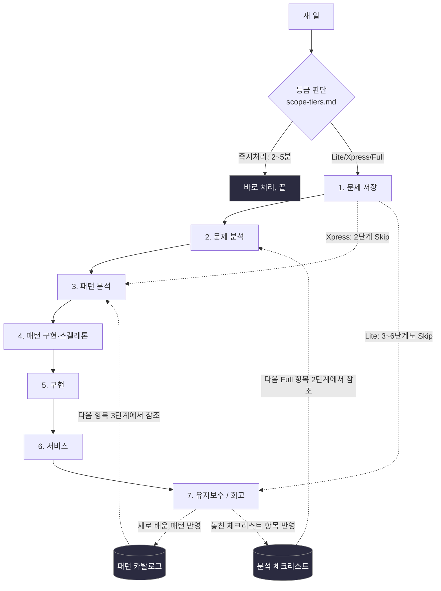
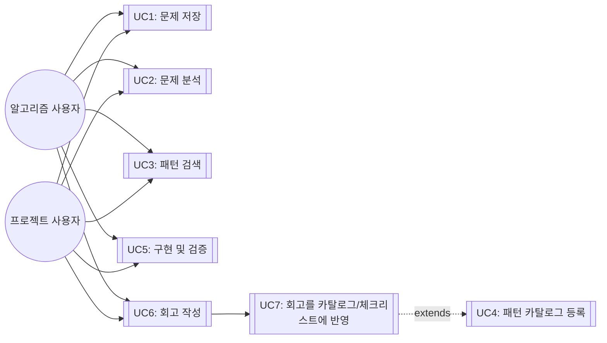

# 개요 — 나만의 개발 워크플로우 시스템

- 이 문서는 `template` 브랜치의 버전입니다 — 시스템 자체(규칙·템플릿·스킬)는
  `main` 브랜치와 동일하지만, 특정 문제/프로젝트를 실제로 풀었던 기록(세션
  파일, 트래커, 카탈로그 누적 항목)은 빠져 있는 **빈 상태**입니다. 다른
  사람이 자기 것으로 시작할 수 있도록 만든 버전이에요 — 시작하는 법은
  [`../../GETTING_STARTED.md`](../../GETTING_STARTED.md) 참고.

이 저장소는 "문제 저장 → 문제 분석 → 패턴 분석 → 패턴 구현 → 구현 → 서비스 → 유지보수"라는
7단계 개인 개발 워크플로우를 설계·기록하는 곳입니다. 각 단계는 `docs/` 아래 자기 폴더를 가지며,
그 단계를 수정할 땐 해당 폴더의 md 파일만 고치면 됩니다.

**새 일을 시작하기 전에 → [scope-tiers.md](scope-tiers.md)** (이 7단계를 다 밟을
가치가 있는 일인지, 아니면 Xpress/Lite/즉시처리로 줄일지부터 정하기)

**각 단계를 제대로 마쳤는지 확인하고 넘어가려면 → [gates.md](gates.md)** (진입기준/완료기준
+ Go·Kill·Hold·Recycle 게이트 결정 규정)

## 원문제 정의

**시나리오**: 새 프로그램/프로젝트를 시작할 때마다 접근 방식이 즉흥적이라, 과거에 배운 패턴이나
실수가 다음 프로젝트에 재사용되지 않는다.

**원하는 결과**: 7단계 프로세스를 만들어서
1. 매번 같은 틀로 진행하고
2. 유지보수 단계에서 얻은 교훈이 패턴 카탈로그/체크리스트로 축적되어 다음 프로젝트에 자동 반영되게 한다.

**적용 대상**: 알고리즘 문제풀이 트랙 / 실무·사이드 프로젝트 트랙 — 두 트랙 모두 틀은 공유하되
각 단계 산출물은 다르게.

## 전체 방향 다이어그램



핵심 둘:
1. 1→7은 선형이 아니라 **7단계 회고가 2·3단계 참조 자료(카탈로그/체크리스트)로 역류하는
   피드백 루프**입니다. 이 루프가 없으면 원문제가 해결되지 않습니다.
2. 모든 일이 7단계를 다 밟지도 않습니다 — [scope-tiers.md](scope-tiers.md) 등급에 따라
   Xpress는 2단계를, Lite는 3~6단계까지 건너뜁니다.

## 폴더 구조

```
.claude/skills/dev-workflow/   Claude Code 스킬 — 명령 3개(문제 저장/패턴 검색/회고 반영)
docs/
  00-overview/          이 문서 + gates.md(게이트 규정) + scope-tiers.md(규모 판단)
  01-problem-save/      1단계: 문제 저장 템플릿(트랙별 + PRD) + sessions/(실제 저장된 항목)
  02-problem-analysis/  2단계: 요구사항 분석 방법론 + 적용 범위(경량화 규칙) + 적용 예시
  03-pattern-analysis/  3단계: 패턴/아키텍처 선택 (ADR-0001 완료) + adr/
  04-pattern-implementation/  4단계: 패턴 스켈레톤 구현 방법론 + 다이어그램 선택 가이드
  05-implementation/    5단계: TDD + 동등분할·경계값 분석 방법론
  06-service/           6단계: Twelve-Factor App + 성능 실측 방법론
  07-maintenance/       7단계: 회고 — 5 Whys + Blameless Postmortem 방법론
  catalog/              패턴 카탈로그, 분석 체크리스트 (지금은 비어 있음 — 회고 때마다 쌓임)
```

## 진행상황 (Progress Log)

이 표는 **시스템 자체**(규칙·템플릿·스킬)가 얼마나 갖춰졌는지를 나타냅니다.
실제로 이 시스템으로 무언가를 풀어본 이력은 이 브랜치엔 없습니다 — 첫 항목을
저장하면 [`sessions/README.md`](../01-problem-save/sessions/README.md) 트래커에
쌓이기 시작합니다.

| 단계 | 상태 | 상세 |
|---|---|---|
| 0. 원문제 정의 | ✅ 완료 | 위 참조 |
| 1. 문제 저장 | ✅ 완료 | [`docs/01-problem-save/`](../01-problem-save/README.md) — 트랙 3개(알고리즘/프로젝트/학습), 인터뷰 기반 필드 채우기 |
| 2. 문제 분석 | ✅ 완료 | 수집(BABOK)→명세(EARS)→정량화(Planguage)→우선순위(MoSCoW×Kano)→추적(RTM) 5단계 파이프라인. [`docs/02-problem-analysis/`](../02-problem-analysis/README.md) |
| 3. 패턴 분석 | ✅ 완료 | ADR-0001로 "파일+Claude Code 스킬 하이브리드" 채택. [`docs/03-pattern-analysis/`](../03-pattern-analysis/README.md) |
| 4. 패턴 구현 | ✅ 완료 (방법론) | Walking Skeleton(Cockburn)/Make it work-right-fast 원칙. `.claude/skills/dev-workflow/SKILL.md`, `sessions/` 폴더 구조. [`docs/04-pattern-implementation/`](../04-pattern-implementation/README.md) |
| 5. 구현 | ✅ 완료 (방법론) | TDD Red-Green-Refactor + 동등분할·경계값 분석. [`docs/05-implementation/`](../05-implementation/README.md) |
| 6. 서비스 | ✅ 완료 (방법론) | Twelve-Factor App + Planguage Goal 실측 규칙. [`docs/06-service/`](../06-service/README.md) |
| 7. 유지보수 | ✅ 완료 (방법론) | 5 Whys + Blameless Postmortem. [`docs/07-maintenance/`](../07-maintenance/README.md) |

**다음 액션**: 시스템은 준비됐고, 실제로 쓴 이력은 아직 없습니다. 첫 문제/
프로젝트를 [`dev-workflow` 스킬](../../.claude/skills/dev-workflow/SKILL.md)로
저장하면서 시작하세요 — 자세한 절차는 [`GETTING_STARTED.md`](../../GETTING_STARTED.md).

## 유즈케이스

### 액터
- **알고리즘 사용자**: 코딩테스트/알고리즘 문제를 푸는 본인
- **프로젝트 사용자**: 실무/사이드 프로젝트를 진행하는 본인



### 유즈케이스 명세 (핵심 3개, Volere 스타일 요약)

**UC1: 문제 저장** — 사전조건 없음(시작점) → 트랙 선택 → 템플릿 작성 → 저장. 관련: FR1
([`docs/01-problem-save/`](../01-problem-save/README.md))

**UC3: 패턴 검색** — 사전조건: UC2에서 태그/유형 확정 → 키워드/태그로 카탈로그 매칭 →
후보를 3단계에 반영. 관련: FR2 ([`docs/catalog/patterns.md`](../catalog/patterns.md))

**UC7: 회고를 카탈로그/체크리스트에 반영** — 사전조건: UC6 완료 → 새 패턴/놓친 체크리스트
항목 식별 → `catalog/` 파일에 추가 → git 커밋으로 이력 남김. 관련: FR3, 원문제 핵심 루프
([`docs/07-maintenance/`](../07-maintenance/README.md))

## 왜 지금 이런 모양인지

이 문서에는 결과만 담았습니다. 어떤 시행착오를 거쳐 지금 구조가 됐는지는
[worklog.md](worklog.md)에 날짜순으로 정리돼 있습니다.
