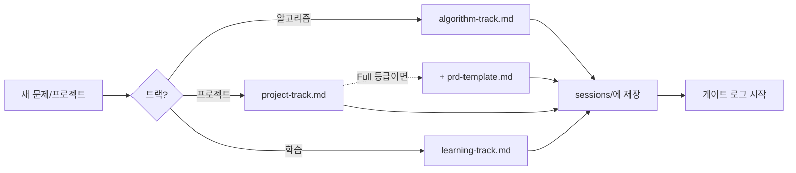

# 1단계: 문제 저장

> 상태: ✅ 완료 (템플릿 + `sessions/` 폴더 구조 확정)

새 문제/프로젝트를 시작할 때 가장 먼저 채우는 단계. 트랙에 따라 템플릿이 다릅니다.

| 파일 | 대상 | 근거 규격 |
|---|---|---|
| [algorithm-track.md](algorithm-track.md) | 알고리즘 문제풀이 | ICPC 문제 명세 규격 |
| [project-track.md](project-track.md) | 실무/사이드 프로젝트 | GitHub Issue Template 규격 |
| [learning-track.md](learning-track.md) | 새로운 개념/기술 학습 기록 | Feynman Technique |
| [prd-template.md](prd-template.md) | Full 등급 프로젝트 트랙 전용 확장판 | Google/Atlassian PRD |

새 트랙이 필요하면 이 폴더에 템플릿 파일 하나만 추가하면 됩니다 — 스킬
로직을 바꿀 필요가 없습니다([ADR-0001](../03-pattern-analysis/adr/0001-storage-and-interface.md)의
Supportability 제약, `learning-track.md`가 실제로 이렇게 추가된 예시입니다).

PRD를 언제 쓰는지는 [scope-tiers.md](../00-overview/scope-tiers.md) 등급으로 정합니다.

## 이 단계에서 지켜야 할 규칙 (IEEE 830 기반)

**IEEE 830**(정식 명칭: *IEEE Recommended Practice for Software Requirements
Specifications*)은 소프트웨어 요구사항 문서의 품질 기준을 정한 표준입니다. 이 저장소
전체(1·2단계)에서 아래 두 규칙을 공통으로 가져다 씁니다.

- 하나의 요구사항/설명 문장에는 하나의 동작만 담는다.
- "빠르다/사용하기 편하다/견고하다" 같은 정성적 표현은 쓰지 않는다. 항상 측정 가능한 숫자로 대체.

## 필드는 어떻게 채우는가 — 인터뷰 기법 (Context-Free Questions)

지금까지는 사용자가 한 번에 설명한 내용을 그대로 필드에 옮겨 적는 방식이었습니다.
문제는 사람이 처음 설명할 때는 보통 본인도 모르게 중요한 정보를 빼먹는다는
것입니다 — 그래서 **AI가 받아 적기만 하지 않고, 되물어서 정보를 끌어내야**
합니다. 근거: Donald Gause와 Gerald Weinberg의 *Exploring Requirements:
Quality Before Design* (1989)이 제시한 **컨텍스트-프리 질문(Context-Free
Questions)** — 아직 문제의 구체적 내용을 모르는 상태에서도 던질 수 있는
정형화된 질문 목록으로, 분석가(여기서는 AI)가 놓치기 쉬운 배경·동기·범위를
드러내는 데 씁니다. BABOK의 Interview 기법([01-elicitation.md](../02-problem-analysis/01-elicitation.md))을
실제로 실행하는 구체적 방법이기도 합니다.

### 기본 질문 세트 (Gause & Weinberg에서 개인 프로젝트용으로 추려냄)

**동기/배경**
- 이 문제를 지금 풀려는 진짜 이유가 뭔가요? (귀찮아서/버그라서/새로 배우고
  싶어서 등 — 이유에 따라 등급·깊이가 달라짐)
- 이미 있는 대안(기존 도구, 예전에 했던 방식)으로는 왜 부족한가요?

**범위/환경**
- 이걸 쓸 사람이 본인 말고 또 있나요? (프로젝트 트랙이면 특히 중요 — 있으면
  이해관계자별 요구가 달라질 수 있음)
- 이 문제가 더 큰 시스템/작업의 일부인가요, 아니면 독립적인가요?

**성공 기준**
- 이게 끝났다고(성공했다고) 어떻게 알 수 있나요? — 숫자로 답이 안 나오면
  "빠르다/편하다" 같은 정성적 표현일 가능성이 높으니 즉시 되묻는다
  (IEEE 830 규칙, 위 참고).
- 잘못되면(버그가 있으면) 어느 정도로 문제가 되나요? — Reliability/Performance
  NFR의 단서가 됨(2단계 Planguage에서 씀).

**메타 질문 (마지막에 꼭 하나)**
- 제가 안 물어봤지만 알아야 할 게 있나요?

### 얼마나 깊게 물을지는 등급에 비례한다

[scope-tiers.md](../00-overview/scope-tiers.md) 등급이 아직 안 정해졌다면,
**동기/배경 질문 1~2개만 먼저 던져서 등급부터 판단**하고(예: "2~5분짜리인가요?"
"LeetCode 문제 번호가 있나요, 아니면 직접 설계해야 하나요?"), 등급이 정해진
뒤에 나머지를 등급에 맞게 조절합니다.

- **Full**: 위 4개 범주를 전부 묻는다. 한 번에 다 묻지 않고 **답변마다 다음
  질문을 좁혀간다** — 진짜 대화처럼. 답이 EARS 초안을 쓸 만큼 구체적이라고
  판단되면, 초안을 보여주고 "이렇게 이해했는데 맞나요?"로 확인받은 뒤에만
  확정한다.
- **Xpress**: 성공 기준(제약조건·예제)만 확인하면 충분한 경우가 많다 —
  동기/범위는 문제 자체(예: LeetCode 문제 번호)가 이미 답하고 있을 때가 많음.
- **Lite/즉시처리**: 인터뷰 생략 — 질문 비용이 일 자체보다 커짐
  ([scope-tiers.md](../00-overview/scope-tiers.md)의 Two-Minute Rule과 같은
  이유).

## 사용 방법

새 문제/프로젝트가 생기면 해당 트랙 파일을 복사해서 (예: `algorithm-track.md` →
`sessions/algorithm-track/2026-09-20-two-sum.md` 같은 실제 항목 파일) 채우세요. 이 폴더
안의 파일은 "템플릿 원본"이고, 실제로 쌓이는 항목들은 [`sessions/`](sessions/README.md)에
`sessions/<트랙파일명>/<YYYY-MM-DD>-<슬러그>.md` 규칙으로 트랙별 저장합니다. 저장한 뒤엔
[`.claude/skills/dev-workflow/SKILL.md`](../../.claude/skills/dev-workflow/SKILL.md)의
안내를 따라 [게이트 로그](../00-overview/gates.md)도 함께 시작합니다.

## 출처
- Gause, D. C. & Weinberg, G. M., *Exploring Requirements: Quality Before
  Design* (1989) — Context-Free Questions,
  [Dorset House 소개](http://www.dorsethouse.com/books/erqbd.html)
- IIBA BABOK Guide, [4.2 Conduct Elicitation](https://www.iiba.org/knowledgehub/business-analysis-body-of-knowledge-babok-guide/4-elicitation-and-collaboration/4.2-conduct-elicitation) — Interview 기법

왜 이 규칙으로 정해졌는지는 [worklog.md](../00-overview/worklog.md)에 있습니다.
