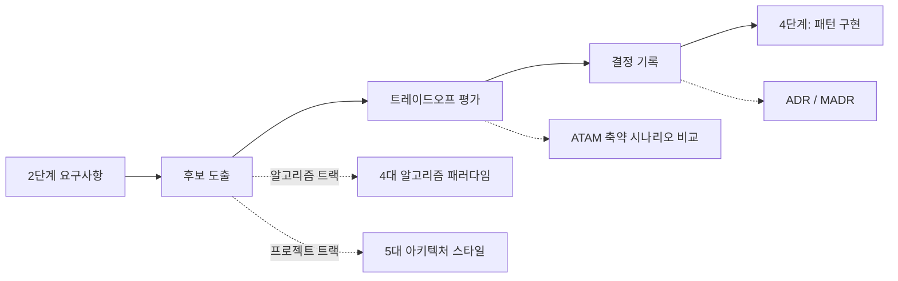

# 3단계: 패턴 분석

> 상태: ✅ 완료 (ADR-0001)

2단계에서 확정된 요구사항을 놓고, 어떤 패턴/아키텍처로 풀지 정하는 단계. **후보 도출 →
트레이드오프 평가 → 결정 기록** 3단계 파이프라인으로 진행합니다.

## 1. 후보 도출

- **알고리즘 트랙** → [01-algorithm-paradigms.md](01-algorithm-paradigms.md) — CLRS 계열
  4대 설계 패러다임(Divide and Conquer / Dynamic Programming / Greedy / Backtracking)
  **+** Two Pointers/Sliding Window 같은 구현 기법 패턴, 두 계층을 함께 확인
- **프로젝트 트랙** → [02-architecture-styles.md](02-architecture-styles.md) (Mark Richards
  5대 아키텍처 스타일: Layered / Event-Driven / Microkernel / Microservices / Space-Based)

두 경우 모두 `docs/catalog/patterns.md`에서 과거 경험을 먼저 검색합니다.

## 2. 트레이드오프 평가

후보가 2개 이상이면 → [03-tradeoff-evaluation-atam.md](03-tradeoff-evaluation-atam.md)
(SEI ATAM을 개인 프로젝트용으로 축약: 2단계 Planguage 시나리오에 후보들을 대입해 비교)

후보가 1개뿐이거나 요구사항이 Kano "Basic"이면 이 단계는 생략 가능.

## 3. 결정 기록

- **알고리즘 트랙**: 선택 근거 한 줄만 남기면 충분 (해당 문제 저장 항목에)
- **프로젝트 트랙**: [adr/](adr/README.md)에 ADR로 기록 — 번호 매기기·불변성·상태
  생애주기 등 실무 규칙 포함

### 이 저장소의 ADR 목록

| ID | 제목 | 상태 |
|---|---|---|
| [0001](adr/0001-storage-and-interface.md) | 워크플로우 인터페이스를 파일+Claude Code 스킬 하이브리드로 결정 | Accepted |

여러분의 첫 ADR은 `0002`부터 시작하세요 — [adr/README.md](adr/README.md) 참고.

## 출처
- Cormen et al., *Introduction to Algorithms* (알고리즘 패러다임 분류)
- Richards, M., *Software Architecture Patterns*, O'Reilly (아키텍처 스타일 카탈로그)
- Kazman, Klein, Clements, *ATAM*, SEI/CMU (트레이드오프 평가)
- Nygard, M., *Documenting Architecture Decisions* (2011); [MADR](https://adr.github.io/madr/) (결정 기록)
