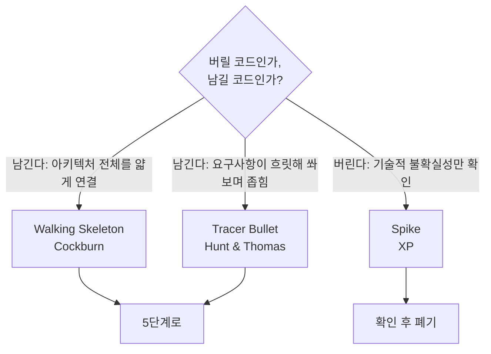

# 4단계: 패턴 구현 (스켈레톤)

> 상태: ✅ 완료 (스켈레톤) — 실전 문제로 검증하는 건 5단계에서 진행

3단계(ADR-0001)에서 선택한 패턴을, 실제 문제 데이터 없이 최소 골격으로 구현해서
구조만 검증하는 단계. 핵심 질문 하나로 방향이 갈립니다: **이 코드는 버릴 건가, 남겨서
키울 건가?**

## 트랙별 방향

| 트랙 | 문서 | 핵심 |
|---|---|---|
| 알고리즘 | [01-algorithm-track-skeleton.md](01-algorithm-track-skeleton.md) | "Make it work, make it right, make it fast" — 브루트포스로 정답부터 |
| 프로젝트 | [02-project-track-skeleton.md](02-project-track-skeleton.md) | Walking Skeleton / Tracer Bullet / Spike 중 상황에 맞게 |
| 다이어그램 | [03-diagramming-guide.md](03-diagramming-guide.md) | 순서도(ISO 5807) / C4 모델 / UML 구조·행동 다이어그램 선택 기준 |

## 이 저장소에 실제로 적용한 결과

- [`.claude/skills/dev-workflow/SKILL.md`](../../.claude/skills/dev-workflow/SKILL.md) —
  ADR-0001의 "파일+스킬 하이브리드"를 구현한 **Walking Skeleton**. 명령 3개(문제 저장/
  패턴 검색/회고 반영)의 실행 절차를 담고 있고, 버릴 코드가 아니라 5단계에서 그대로
  자라날 골격입니다.
- [`docs/01-problem-save/sessions/`](../01-problem-save/sessions/README.md) — 1단계
  세션 폴더 구조.

첫 몇 개 항목을 이 스켈레톤으로 실제로 저장해보면서 트랙 자동 인식·명령
1·2 절차가 실전에서도 매끄러운지 검증하는 게 다음 순서입니다.

## 아직 검증 안 된 것 (5단계로 넘김)

- **자연어 트리거 자체**는 Walking Skeleton의 일부가 아니라 [Spike](02-project-track-skeleton.md)
  성격의 불확실성입니다 — 확인만 하고 코드를 키우지 않습니다.
- Planguage Usability Goal(템플릿 작성 5분 이내) 실측 — [6단계](../06-service/README.md)에서.
