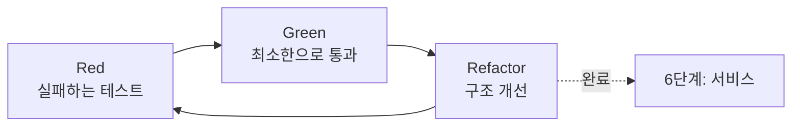

# 5단계: 구현

> 상태: ✅ 방법론 정의 완료 — 실제 적용 사례는 아직 없습니다(첫 항목을
> 구현하면 여기에 실제 사례가 쌓입니다).

패턴 스켈레톤을 실제 문제/요구사항에 맞게 완성하는 단계.



## 방향을 정하는 표준 개념

| 개념 | 문서 | 핵심 |
|---|---|---|
| 개발 리듬 | [01-tdd-red-green-refactor.md](01-tdd-red-green-refactor.md) | Kent Beck의 TDD Red-Green-Refactor 순환. 알고리즘 트랙은 "Refactor 자리에 최적화"로 변형 |
| 테스트 설계 | [02-boundary-value-equivalence.md](02-boundary-value-equivalence.md) | ISO/IEC/IEEE 29119의 동등분할 + 경계값 분석으로 "뭘 엣지 케이스로 볼지" 체계적으로 뽑기 |

## 코드는 어디에 두는가

`docs/`는 방법론·기록용이라 실제 코드는 저장소 최상위 `implementations/`에 둡니다 —
1단계 `sessions/`와 같은 이름 규칙입니다.

```
implementations/
  run_all_tests.py       # 모든 항목의 test_solution.py를 한 번에 실행
  <트랙파일명>/<세션 슬러그>/
    solution.py           # 구현 (알고리즘 트랙: 브루트포스 + 최적화 버전 둘 다 남김)
    test_solution.py       # 단위 테스트 + 경계값/차등 테스트
    benchmark.py            # (6단계) 성능 실측, 선택
```

새 항목을 추가한 뒤나, 다른 항목을 건드린 뒤에는 `python3 implementations/run_all_tests.py`로
전체가 여전히 통과하는지 한 번에 확인합니다 — 항목이 늘어날수록 하나씩 따로
돌려보는 게 비현실적이라 이 스크립트를 별도로 둡니다.

## 이 단계에서 하는 일

- 완성 코드 + 단위 테스트 (Red-Green-Refactor 순환으로)
- **Full 등급**: 엣지 케이스는 2단계 EARS Unwanted-behavior 요구사항 기준
- **Xpress/Lite 등급** (2단계를 생략한 경우): 2단계 명세가 없으므로, 대신
  동등분할/경계값 분석만으로 엣지 케이스를 뽑고 브루트포스 대비 차등 테스트로 보강
- 완료 후 [6단계](../06-service/README.md)로 전달

## 실제 사례

_(아직 없음 — 첫 항목을 5단계까지 진행하면 여기에 표로 쌓입니다: 문제/코드/
Refactor 방향/테스트 개수.)_
