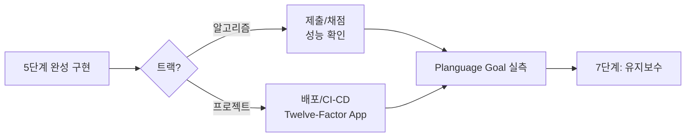

# 6단계: 서비스

> 상태: ✅ 방법론 정의 완료 — 실제 성능 실측/Planguage Goal 사례는 아직
> 없습니다. 전체 목록은
> [sessions/README.md 트래커](../01-problem-save/sessions/README.md) 참고.

완성된 구현을 실제로 사용 가능한 형태로 내보내는 단계. **2단계에서 정한 Planguage
Goal을 실측하는 자리**이기도 합니다 — 정량화만 해놓고 실측을 안 하면 2단계 작업이
무의미해집니다.

## 방향을 정하는 표준 개념

| 트랙 | 개념 | 핵심 |
|---|---|---|
| 프로젝트 | [01-twelve-factor-app.md](01-twelve-factor-app.md) | Heroku Twelve-Factor App 중 개인 프로젝트에 우선 적용할 5가지(Config/Backing Services/Build-Release-Run/Processes/Logs) |

## 이 단계에서 하는 일

- **알고리즘 트랙**: 제출/채점 대신 성능(런타임) 실측 → 아래 "알고리즘 트랙 성능 실측"
- **프로젝트 트랙**: Twelve-Factor 원칙 적용 + Planguage Goal 실측 → 아래 두 섹션
- 완료 후 [7단계](../07-maintenance/README.md)로 전달

> **이 저장소의 한계**: 실제 LeetCode 제출은 이 세션에서 할 수 없습니다(계정/브라우저
> 접근이 필요). "채점" 대신 **정확성은 5단계 테스트로, 성능은 아래 실측으로** 대체합니다.

## 알고리즘 트랙 성능 실측

각 구현 폴더의 `benchmark.py`로 제약조건 상한 근처에서 브루트포스 대비 최적화의
실제 속도 차이를 측정합니다.

> **체크리스트**: 벤치마크의 "최악 케이스" 입력은 반드시 실행해서 확인하세요
> — 논리적으로 최악처럼 보이는 입력이 우연히 더 빨리 끝나는 경우가 실제로
> 있습니다(`docs/catalog/checklist.md`의 "6단계 성능 실측 체크리스트" 참고).
> 작은 크기 여러 개에서 추세(예: n을 2배씩 늘렸을 때 시간이 몇 배씩 느는지)를
> 먼저 확인한 뒤, 제약조건 상한에서 실제 값을 측정하는 순서를 권장합니다.

| 문제 | 브루트포스 | 최적화 | 비고 |
|---|---|---|---|
| _(아직 없음)_ | | | |

## Planguage Goal 실측

[2단계](../02-problem-analysis/03-quantification-planguage.md)에서 비기능 요구사항마다
정한 `Scale/Meter/Goal`을 여기서 실제로 측정합니다.

| Goal 예시 | 측정 방법 |
|---|---|
| Usability: "5분 이내 작성" | 실제 사용해보며 타이머로 측정 |
| Supportability: "새 트랙 추가 시 기존 파일 0개 수정" | 다음 트랙 추가 커밋에서 `git diff --stat`으로 확인 |

측정 결과가 Goal 미달이면, 그 사실 자체가 7단계 회고의 입력이 됩니다.

## 프로젝트 트랙 실제 사례

_(아직 없음 — 첫 프로젝트를 6단계까지 진행하면 여기에 Twelve-Factor 적용
내역과 Planguage Goal 실측 표가 쌓입니다.)_
