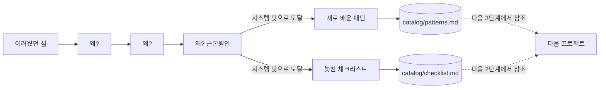

# 7단계: 유지보수

> 상태: ✅ 방법론 정의 완료 — 실제 회고 사례는 아직 없습니다. 전체 목록·회고
> 링크는 [sessions/README.md 트래커](../01-problem-save/sessions/README.md) 참고.

이 워크플로우의 핵심 피드백 루프가 일어나는 단계 (원문제: "배운 게 재사용 안 됨"을
해결하는 지점).



## 회고 템플릿

```
날짜:
문제/프로젝트:
잘된 점:
어려웠던 점:
  → 5 Whys (근본원인까지 파고들기):
    1. 왜?
    2. 왜?
    3. 왜? (근본원인에 도달할 때까지 반복, 보통 3~5회)
새로 배운 패턴 (있다면) → catalog/patterns.md에 추가:
놓쳤던 체크리스트 항목 (있다면) → catalog/checklist.md에 추가:
```

## 두 가지 원칙

| 원칙 | 출처 | 핵심 |
|---|---|---|
| **5 Whys** | 도요타 생산방식 (Sakichi Toyoda, 1930년대) | "왜?"를 반복해서 표면 증상이 아니라 구조적 원인까지 파고든다 |
| **Blameless** | John Allspaw (Etsy, 2012) → Google SRE | 답이 "내가 부주의했다" 같은 사람 탓이 아니라 **시스템/프로세스의 빈틈** 쪽으로 향해야 한다 |

두 원칙을 같이 써야 하는 이유: 5 Whys로 파고들어도 "내가 집중을 안 해서"에서 멈추면
아무것도 안 바뀝니다. "체크리스트에 그 항목이 없어서 확인할 방법 자체가 없었다"까지
가야 `checklist.md`에 추가할 항목이 명확해지고, 다음엔 실제로 안 놓칩니다.

## 절차 (UC7 참조)

1. 회고 작성 (위 템플릿, 5 Whys로 근본원인까지, Blameless하게)
2. "새로 배운 패턴" → [`docs/catalog/patterns.md`](../catalog/patterns.md)에 Volere
   카드 형식으로 추가
3. "놓쳤던 체크리스트 항목" → [`docs/catalog/checklist.md`](../catalog/checklist.md)에
   (근본원인을 반영해서) 추가
4. git 커밋으로 이력 남기기 (어떤 프로젝트/문제에서 나온 교훈인지 명시)

이 단계를 건너뛰면 다음 프로젝트의 [2단계](../02-problem-analysis/README.md)·
[3단계](../03-pattern-analysis/README.md)가 과거 경험을 참조하지 못합니다 — 원문제가
재발합니다.

## 출처
- [Five whys - Wikipedia](https://en.wikipedia.org/wiki/Five_whys)
- Allspaw, J., *Blameless PostMortems and a Just Culture* (2012) —
  [Google SRE Book: Postmortem Culture](https://sre.google/sre-book/postmortem-culture/)
