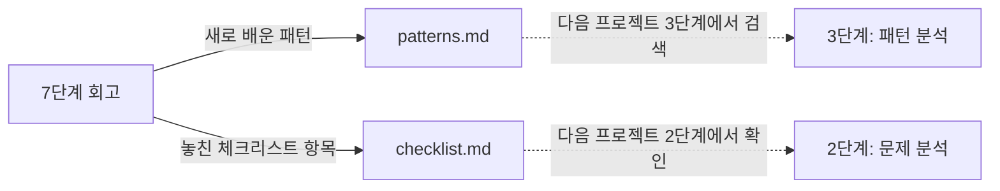

# catalog/ — 계속 누적되는 공용 참조 자료

7단계(유지보수) 회고에서 나온 결과가 쌓이는 곳이자, 2·3단계에서 매번 다시 찾아보는
곳입니다. 이 두 파일이 이 시스템의 피드백 루프를 실제로 담는 그릇입니다.

| 파일 | 역할 | 누가/언제 채우는가 |
|---|---|---|
| [patterns.md](patterns.md) | 알고리즘 기법·아키텍처 패턴 카탈로그 (Volere 카드 형식, 트랙/계층 구분) | 7단계 회고에서 "새로 배운 패턴"이 나올 때 |
| [checklist.md](checklist.md) | 요구사항 분석 체크리스트 | 7단계 회고에서 "놓쳤던 항목"이 나올 때 |

두 파일 모두 처음엔 비어있다가 실제로 프로젝트를 진행하면서 자랍니다. 지금까지 실제로
채워진 내용과 그게 어떻게 재사용됐는지는 [worklog.md](../00-overview/worklog.md)의
"핵심 피드백 루프 실증" 항목을 참고하세요.
